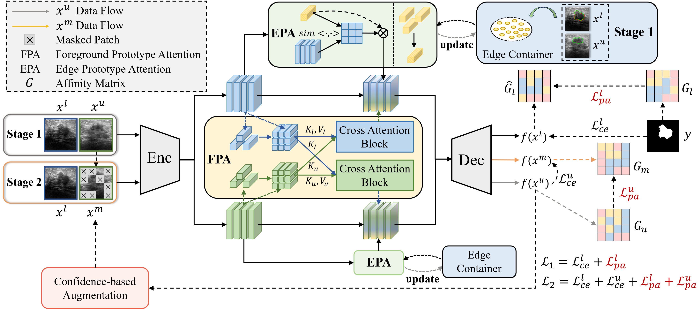

# CSC-PA

Official PyTorch implementation of "[CSC-PA: Cross-image Semantic Correlation via Prototype Attentions for Single-network Semi-supervised Breast Tumor Segmentation](https://openaccess.thecvf.com/content/CVPR2025/papers/Ding_CSC-PA_Cross-image_Semantic_Correlation_via_Prototype_Attentions_for_Single-network_Semi-supervised_CVPR_2025_paper.pdf)", CVPR 2025.

Zhenhui Ding, Guilian Chen, Qin Zhang, Huisi Wu*, Jing Qin

[[Paper]](https://openaccess.thecvf.com/content/CVPR2025/papers/Ding_CSC-PA_Cross-image_Semantic_Correlation_via_Prototype_Attentions_for_Single-network_Semi-supervised_CVPR_2025_paper.pdf) [[Project]](https://github.com/shdkdh/CSC-PA)



# Usage
-----
## Train
Use train.py to train.

**Configurations**

_Script path_

```
xxx\envs\xxx\lib\python3.9\site-packages\torch\distributed\run.py
```

_Parameters_

```
--nproc_per_node=1
--nnodes=1
--node_rank=0
--master_addr=localhost
--master_port=8887
xxx/train.py
--seed 2
--port 8887
```

## Test
Use test.py to test.

# Acknowledgement
-----
The work is based on [U2PL](https://github.com/Haochen-Wang409/U2PL/) and [AugSeg](https://github.com/ZhenZHAO/AugSeg). Thanks for the open source contributions to these efforts!

# Citation
-----
If you find our work useful, please cite our paper, thank you!
```
@inproceedings{ding2025csc,
  title={CSC-PA: Cross-image Semantic Correlation via Prototype Attentions for Single-network Semi-supervised Breast Tumor Segmentation},
  author={Ding, Zhenhui and Chen, Guilian and Zhang, Qin and Wu, Huisi and Qin, Jing},
  booktitle={Proceedings of the Computer Vision and Pattern Recognition Conference},
  pages={15632--15641},
  year={2025}
}
```
